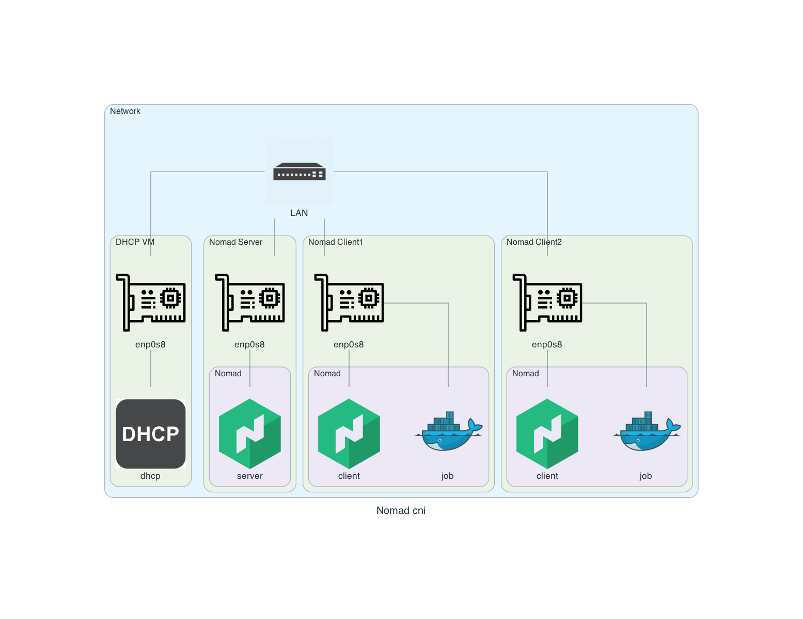

#


## pre-requirement

- virtualbox 7.0 or latest
- vagrant 2.3.3 or latest

tested on MACOX Intel

### How to use

- clone

```
git clone https://github.com/kikitux/nomad_cni_macvlan_dhcp.git
```

- change directory

```
cd nomad_cni_macvlan_dhcp
```

- create vms

```
vagrant up
```

### run nomad job

```
vagrant ssh client2
cd /vagrant
nomad job run nomad/sample_cni_macvlan_dhcp.hcl 
```

Sample output

```
vagrant@client1:/vagrant$ nomad job run nomad/sample_cni_macvlan_dhcp.hcl 
==> 2022-11-23T18:46:00Z: Monitoring evaluation "67a887bd"
    2022-11-23T18:46:00Z: Evaluation triggered by job "api"
    2022-11-23T18:46:00Z: Allocation "5be7d83c" created: node "0d3cfd47", group "api"
    2022-11-23T18:46:01Z: Evaluation within deployment: "77dad620"
    2022-11-23T18:46:01Z: Evaluation status changed: "pending" -> "complete"
==> 2022-11-23T18:46:01Z: Evaluation "67a887bd" finished with status "complete"
==> 2022-11-23T18:46:01Z: Monitoring deployment "77dad620"
  ✓ Deployment "77dad620" successful
    
    2022-11-23T18:46:17Z
    ID          = 77dad620
    Job ID      = api
    Job Version = 2
    Status      = successful
    Description = Deployment completed successfully
    
    Deployed
    Task Group  Desired  Placed  Healthy  Unhealthy  Progress Deadline
    api         1        1       1        0          2022-11-23T18:56:16Z
vagrant@client1:/vagrant$ nomad job allocs api
ID        Node ID   Task Group  Version  Desired  Status    Created    Modified
5be7d83c  0d3cfd47  api         2        run      running   22s ago    6s ago
vagrant@client1:/vagrant$ nomad alloc exec -i -t -task redis 5be7d83c /bin/bash
root@e7aeabbbeb5b:/data# hostname -i
192.168.210.72
root@e7aeabbbeb5b:/data# hostname -I
192.168.210.72 
root@e7aeabbbeb5b:/data# 
exit
vagrant@client1:/vagrant$ 
```
